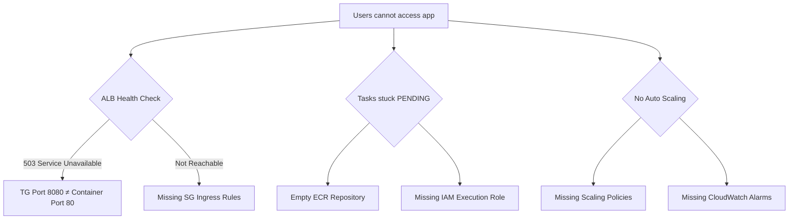

# ECS Troubleshooting — Change Log

All infrastructure changes applied to resolve the ECS service outage.

| # | Date | What | Where | Why | Evidence |
|---|------|------|-------|-----|----------|
| 1 | 2026-02-20 | Added IAM Task Execution Role + Task Role | `08_iam.tf` | File was empty — ECS had no permissions to pull images from ECR or push logs to CloudWatch. Without `AmazonECSTaskExecutionRolePolicy`, all tasks failed with `CannotPullContainerError`. | `terraform apply` succeeded; tasks started pulling images. CloudWatch log streams created. |
| 2 | 2026-02-20 | Added Target Group + linked to ALB Listener | `11_alb.tf` | Listener had `type = "forward"` but no `target_group_arn` — no backend to route traffic to. Added `aws_lb_target_group` with `target_type = "ip"` for Fargate compatibility. | `terraform plan` showed new TG resource; listener linked correctly. |
| 3 | 2026-02-20 | Added `target_group_arn` to ECS Service `load_balancer` block | `12_ecs.tf` | Service was not registering tasks in the Target Group — ALB had no healthy targets. | ECS Service Events: tasks registered in TG as `healthy`. |
| 4 | 2026-02-20 | Added Auto Scaling policies + CloudWatch Alarms | `12_ecs.tf` | Only `aws_appautoscaling_target` existed — no policies or alarms to trigger scale-out/in. CPU spikes had no effect on desired count. | CloudWatch Alarms visible in console. Scale-out confirmed under ApacheBench load test. |
| 5 | 2026-02-23 | Fixed Target Group port `8080` → `80` and Health Check path `/health` → `/` | `11_alb.tf` | TG port mismatch caused ALB to forward traffic to wrong port. Health Check path `/health` doesn't exist on nginx — all targets marked `unhealthy` → ALB returned 503. Used `name_prefix` + `lifecycle { create_before_destroy = true }` to avoid `ResourceInUse` conflict. | `terraform apply` completed zero-downtime replacement. `curl <ALB_DNS>` → HTTP 200. |
| 6 | 2026-02-23 | Added Ingress rules to ALB SG (port 80 from `0.0.0.0/0`) and Tasks SG (port 80 from ALB SG) | `10_security_groups.tf` | Both SGs had only Egress rules — all inbound traffic was blocked. ALB showed "HTTP:80 Not Reachable". Tasks couldn't receive forwarded requests. | `curl <ALB_DNS>` → HTTP 200. Connection timeout resolved. |

## Summary of Root Causes

## Files Modified

| File | Changes |
|------|---------|
| `08_iam.tf` | Created from scratch — added `task_execution` role, `task_role`, and `AmazonECSTaskExecutionRolePolicy` attachment |
| `10_security_groups.tf` | Added Ingress rules to both `alb` and `tasks` Security Groups |
| `11_alb.tf` | Added `aws_lb_target_group`, linked to listener, fixed port and health check |
| `12_ecs.tf` | Added `target_group_arn` to service, added 2 scaling policies + 2 CloudWatch alarms |
