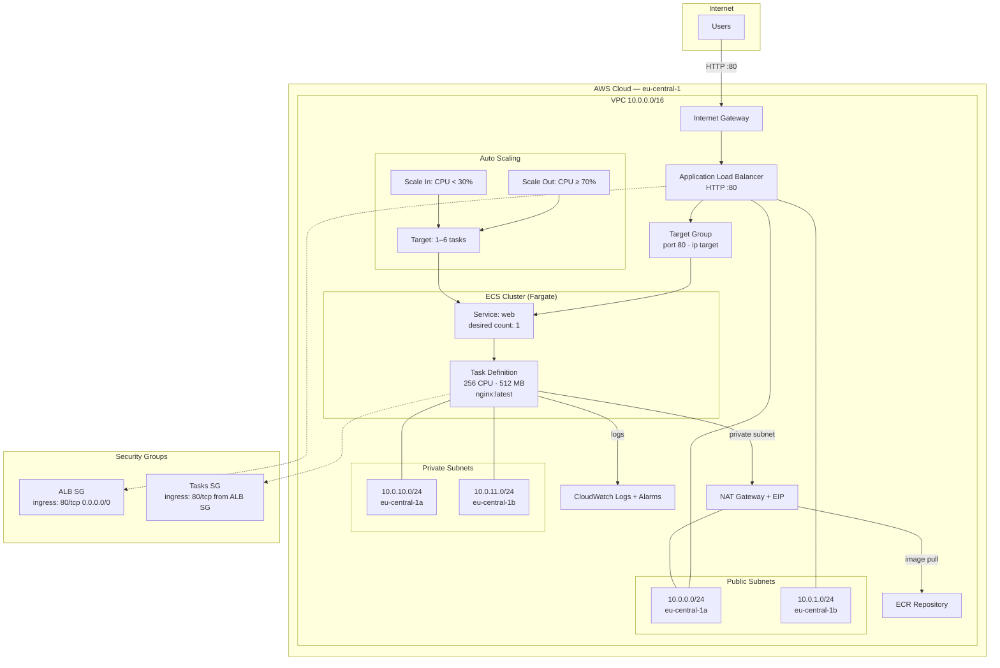

# ECS Troubleshooting Task

Diagnose and remediate a broken ECS Fargate service behind an Application Load Balancer.

## Architecture



## Issues Found & Fixed

| # | Issue | Root Cause | Fix |
|---|-------|-----------|-----|
| 1 | ALB returning 503 | Target Group port `8080`, health check `/health` | Changed to port `80`, path `/` |
| 2 | HTTP:80 "Not Reachable" | Missing Security Group ingress rules | Added ingress to ALB SG and Tasks SG |
| 3 | Tasks stuck in PENDING | Empty ECR repository + missing IAM roles | Pushed image to ECR, created IAM roles |
| 4 | No auto scaling | Missing scaling policies and CloudWatch alarms | Added step scaling policies + CPU alarms |

## Project Structure

```
├── 01_backend.tf          # Local state backend
├── 02_providers.tf        # AWS provider config
├── 03_versions.tf         # Terraform + provider versions
├── 04_variables.tf        # Input variables
├── 05_outputs.tf          # Outputs
├── 06_networking.tf       # VPC, subnets, IGW, NAT, route tables
├── 07_ecr.tf              # ECR repository + lifecycle policy
├── 08_iam.tf              # Task execution + task IAM roles
├── 09_logs.tf             # CloudWatch log group
├── 10_security_groups.tf  # ALB + ECS tasks security groups
├── 11_alb.tf              # ALB, listener, target group
├── 12_ecs.tf              # Cluster, task def, service, scaling
├── 13_autoscaling.tf      # Auto scaling target
├── Dockerfile             # nginx:alpine + curl
├── RUNBOOK.md             # Incident runbook
└── CHANGELOG.md           # Change log with evidence
```

## Usage

```bash
terraform init
terraform plan
terraform apply
```

## Documentation

- [RUNBOOK.md](RUNBOOK.md) — Root cause analysis and remediation steps
- [CHANGELOG.md](CHANGELOG.md) — Change log with evidence
