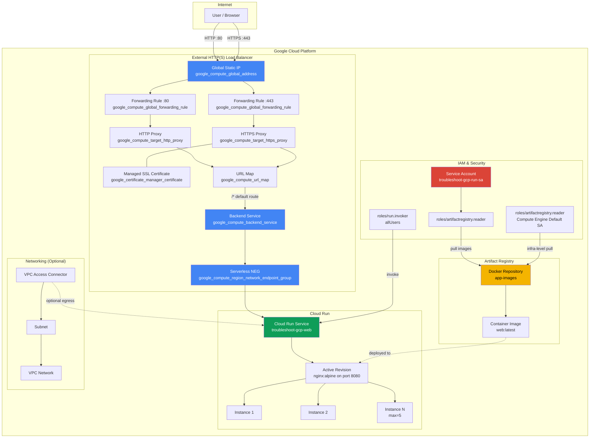

# Infrastructure Diagram — Cloud Run with External HTTP(S) Load Balancer

## Data Flow

1. **User** sends HTTP/HTTPS request to the **Global Static IP**
2. **Forwarding Rule** routes to the appropriate **HTTP/HTTPS Proxy**
3. **HTTPS Proxy** terminates TLS using the **Managed SSL Certificate**
4. **URL Map** routes all paths (`/*`) to the **Backend Service**
5. **Backend Service** forwards to the **Serverless NEG**
6. **Serverless NEG** routes to the **Cloud Run Service**
7. **Cloud Run** auto-scales instances (min=1, max=5) based on concurrency/RPS
8. Container images are pulled from **Artifact Registry** using IAM permissions granted to both the runtime SA and the Compute Engine default SA
