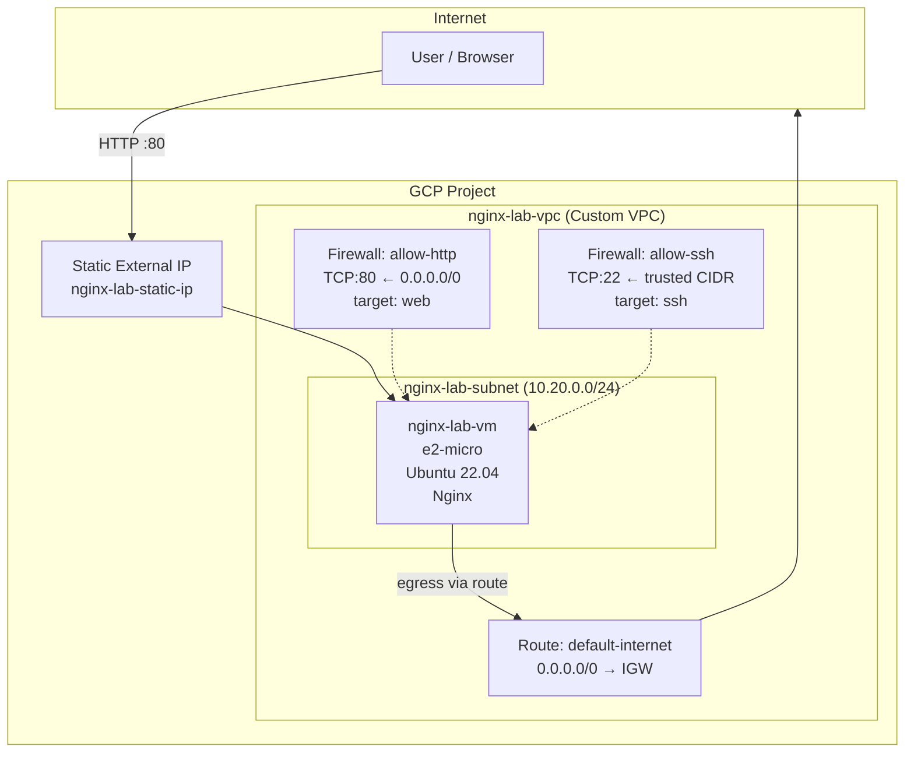

# Infrastructure Analysis & Improvement Recommendations

## Architecture Diagram

## Identified Issues & Fixes Applied

| # | Issue | Root Cause | Fix |
|---|-------|-----------|-----|
| 1 | VM unreachable from internet | No `access_config` in `network_interface` — no external IP assigned | Added `google_compute_address` (static) + `access_config` block |
| 2 | Startup script fails to install packages | `delete_default_routes_on_create = true` with no replacement route — VM has no egress to internet | Added `google_compute_route` with `0.0.0.0/0` → `default-internet-gateway` |
| 3 | No traffic allowed to VM | Zero firewall rules defined in the VPC | Added `allow-http` (TCP:80 from 0.0.0.0/0) and `allow-ssh` (TCP:22 from trusted CIDR) |
| 4 | Nginx not installed | No `metadata_startup_script` defined on the VM | Added startup script: `apt-get install nginx` + `systemctl enable/start` |

## Improvement Recommendations

### 1. Cost Optimization

**Current issue:** Static external IP incurs charges when not attached to a running VM.

**Recommendations:**
- Use **preemptible / spot VMs** for non-production workloads — up to 60-91% cost reduction vs on-demand pricing
- Consider **committed use discounts** for long-running production instances
- Implement **scheduling** (start/stop) for dev/staging environments to avoid paying for idle resources
- Evaluate whether `e2-micro` is appropriate — GCP offers 1 free `e2-micro` instance per month in eligible regions

### 2. Automation & Infrastructure as Code

**Current issue:** Single flat `04_main.tf` with all resources mixed together.

**Recommendations:**
- **Modularize Terraform** — split into logical modules (`modules/networking`, `modules/compute`, `modules/firewall`)
- Use **`terraform.tfvars`** files per environment (dev/staging/prod) instead of hardcoded defaults
- Implement **remote state** with GCS backend + state locking to enable team collaboration
- Add **CI/CD pipeline** for Terraform (plan on PR, apply on merge) to prevent manual drift
- Use **`terraform fmt`** and **`tflint`** in pre-commit hooks for code quality

### 3. Security Hardening

**Current issue:** Broad service account scopes, no health checks, no logging.

**Recommendations:**
- **Restrict service account scopes** — `cloud-platform` grants full API access; scope down to only what's needed (e.g., `compute-ro`, `logging-write`)
- Create a **dedicated service account** instead of using the default compute SA
- Enable **OS Login** instead of project-wide SSH keys for better IAM-based access control
- Add **Cloud Armor** or at minimum use **IAP (Identity-Aware Proxy)** for SSH instead of exposing port 22 to any CIDR
- Enable **Shielded VM** features (Secure Boot, vTPM, Integrity Monitoring)
- Implement **VPC Flow Logs** on the subnet for network traffic auditing

### 4. Reliability & Maintenance

**Current issue:** Single VM, no health checks, no auto-recovery.

**Recommendations:**
- Use a **Managed Instance Group (MIG)** with auto-healing instead of a standalone VM — if the VM crashes, GCP automatically recreates it
- Add a **health check** on port 80 to detect nginx failures
- Place the VM behind a **HTTP(S) Load Balancer** for SSL termination, CDN caching, and DDoS protection
- Use a **custom image** with nginx pre-baked (via Packer) instead of startup script — reduces boot time from ~60s to ~10s and eliminates dependency on external package repos during boot
- Enable **automatic OS patching** via OS Patch Management
- Configure **Cloud Monitoring** alerts for CPU, memory, and nginx process health

### 5. Observability

**Recommendations:**
- Install **Ops Agent** for structured logging and system metrics
- Export logs to **Cloud Logging** with log-based metrics and alerting
- Set up **uptime checks** in Cloud Monitoring to verify HTTP:80 availability
- Create a **dashboard** with key metrics: request rate, latency, error rate, VM health
